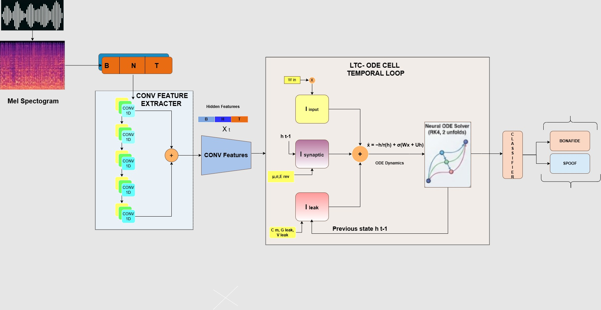

## Liquid Neural Network Audio Deepfake Detector

This project investigates **audio deepfake detection** using **Liquid Neural Networks (LNNs)** to model temporal speech dynamics in continuous time. 
Unlike conventional RNN/LSTM-based detectors, the proposed approach leverages **Liquid Time-Constant (LTC) neurons** governed by learnable differential equations, enabling improved generalization across datasets. 
The model is evaluated on **ASVspoof**, **MLAAD**, and **In-the-Wild (ITW)** audio deepfake benchmarks, focusing on cross-domain robustness.

---

## Model Architecture

The pipeline converts raw audio into **mel-spectrograms**, extracts local representations using a convolutional front-end, and models temporal dependencies using an **LTC-based ODE cell**, followed by bonafide/spoof classification.

---

## Liquid Neural Network Dynamics

The hidden state of the Liquid Neural Network evolves according to a continuous-time differential equation:

\[
\frac{dx(t)}{dt} = -\frac{1}{\tau} x(t) + \sigma \left( W x(t) + U u(t) + b \right)
\]

where:
- \(x(t)\) represents the neuron state,
- \(u(t)\) is the input feature vector,
- \(\tau\) is a learnable time constant,
- \(W, U, b\) are trainable parameters,
- \(\sigma(\cdot)\) denotes a nonlinear activation.

The ODE is numerically solved using a Runge–Kutta (RK4) scheme, enabling adaptive temporal modeling for variable-length and in-the-wild audio signals.
